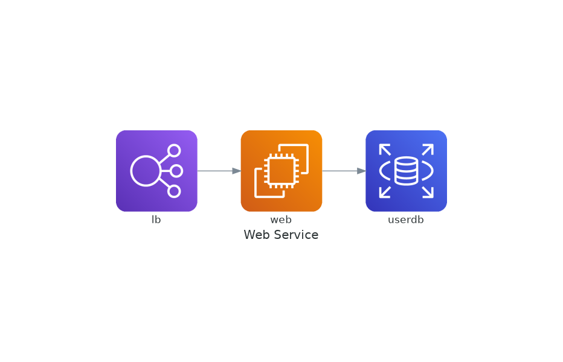

# Dependencies
```
pacman -Ss graphviz
```

```
pip install --user diagrams
```


# Build
```
python diagram.py
```

# Example from [Diagrams](https://diagrams.mingrammer.com/)

```python
from diagrams import Diagram
from diagrams.aws.compute import EC2
from diagrams.aws.database import RDS
from diagrams.aws.network import ELB

with Diagram("Web Service", show=False):
    ELB("lb") >> EC2("web") >> RDS("userdb")
```



